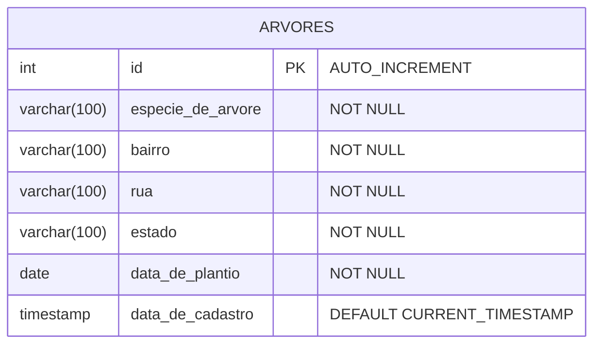

```mermaid
erDiagram
    ARVORES {
        int id PK "AUTO_INCREMENT"
        varchar(100) especie_de_arvore "NOT NULL"
        varchar(100) bairro "NOT NULL"
        varchar(100) rua "NOT NULL"
        varchar(100) estado "NOT NULL"
        date data_de_plantio "NOT NULL"
        timestamp data_de_cadastro "DEFAULT CURRENT_TIMESTAMP"
    }
```