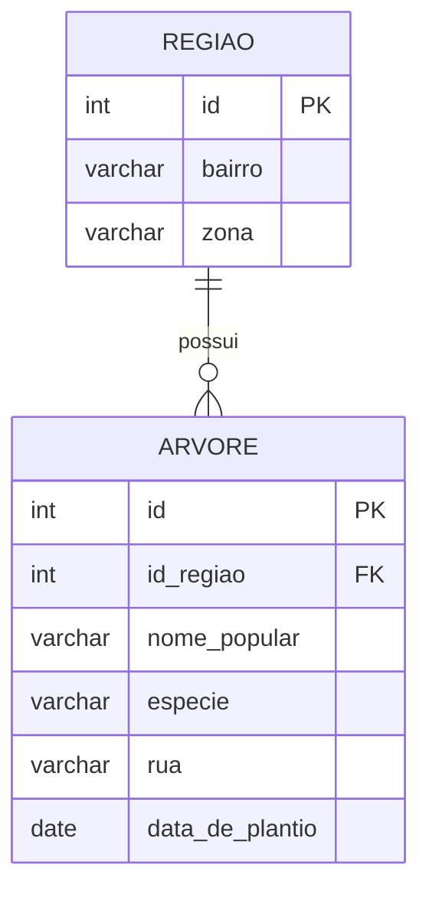

```mermaid
erDiagram
    REGIAO ||--o{ ARVORE : "possui"

    REGIAO {
        int id PK
        varchar bairro
        varchar zona
    }

    ARVORE {
        int id PK
        int id_regiao FK
        varchar nome_popular
        varchar especie
        varchar rua
        date data_de_plantio
    }
```